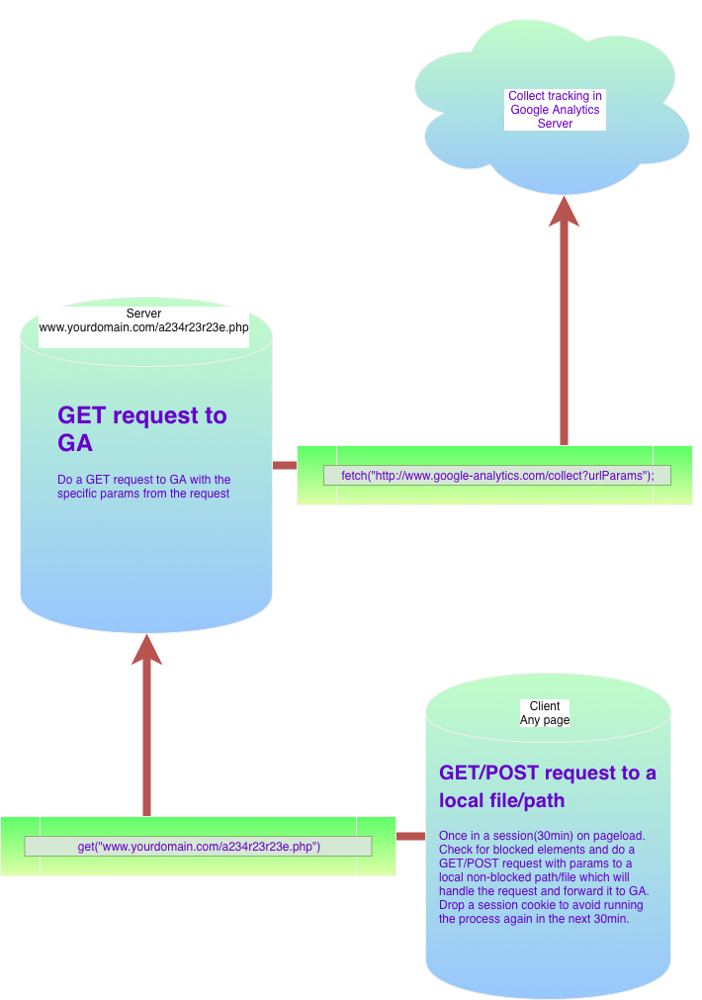

# Content Blocker Detection(cbd) script - `js + php + GA Measurement Protocol`
This script is a bait for content blockers to hide some elements or block a network request in order to reveil themselves. It will displatch and event to  the server so you can measure the impact of visits on your website with content blockers so you can estimate how much of your traffic is missing in your client-side Analytics suite.
It should be a two-part script:
* This part is the client one - for detection
* The other part is the server one - a file or path to handle the call to Analytics

## The client-side script (`cbd.js`)
* Has to run after the DOM has loaded so that content blockers have started to scrape the page
* Creates two DOM elements : an image and a paragraph
* Targets both EasyList and EasyPrivacy lists that are used in all browser extensions content blockers
* Firefox doesn't need a content blocker since `version 65` as it automatically blocks trackers
* Makes an XMLHTTP request to your desired server path to send the analytics call
* Uses `sessionStorage` to avoid making another call to Analytics within the same session. You can use cookies or any other method to achieve that. Or you may want to dispatch the event on every pageview - it is up to you.

## The server
* Use a random name for the server file that you will call from the client so it won't get blocked
* I use Google Analytics API to send the Analytics request from server therefore the following steps are relevant to Google Analytics only:
     * Do a GET request to GA using the [Google Analytics Measurement Protocol](https://developers.google.com/analytics/devguides/collection/protocol/v1/devguide "Google Analytics Measurement Protocol"). Here is the end point url: `www.google-analytics.com`
     * Example [url parameters](https://developers.google.com/analytics/devguides/collection/protocol/v1/parameters "Google Analytics Measurement Protocol parameters reference") : `v=1&tid=UA-XXXXX-Y&cid=555&t=event&ec=ContnetBlockerDetection&el=VisitWithContentBlocker`
     * Test your Analytics call with the [Hit builder](https://ga-dev-tools.appspot.com/hit-builder/ "Google Analytics Measurement Protocol hit builder") first

## Example call to server
* GET : `https://yourdomain.com/a234r23r23e.php?a=true` if content blocker is present or `https://yourdomain.com/234r23r23e.php?a=false` if not
* POST : `https://yourdomain.com/a234r23r23e.php` with arguments = `a=true/false`

## Simplified Example call from server with PHP
* Assume you have a PHP file on the server called `a234r23r23e.php` with the following contents:
     ```php
     $sGaUrl = 'http://www.google-analytics.com/collect?v=1&tid=UA-XXXXX-Y&cid=555&hc=hostNameHere&dp=pathHere&dt=pageTitleHere&t=event&ec=ContnetBlockerDetection';
     if(($_POST["a"] && $_POST["a"] == "true") || ($_GET["a"] && $_GET["a"] == "true") ){
          file_get_contents($sGaUrl.'&el=VisitWithContentBlocker');
     }else{
          file_get_contents($sGaUrl.'&el=VisitWithoutContentBlocker');
     }
     ```

     